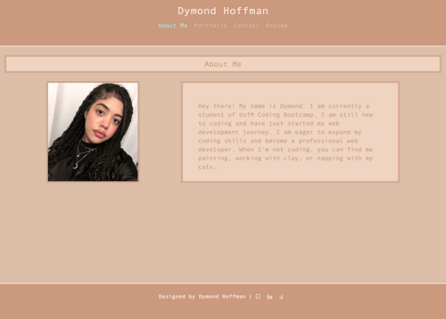

# React-Portfolio

## Description
Portfolios are an essential part of becoming a web developer. They allow potential employers to review samples of work and assess candidacy for open positions. 

This new and improved react portfolio contains samples of recent work, an about me section, contact information, a list of proficiencies, resume, and a contact form.

The 'About Me'' section includes a recent photo of myself along with a few fun facts. Within the 'Portfolio' section, there are six coding samples displayed with links to the github repo. When you click on the project image, you will be redirected to the deployed website. The 'Contact' section includes a contact form to leave a message. Lastly, the 'Resume' section includes and list of my proficiencies and a link to downlad my resume. My GitHub, LinkedIn, and Stack Overflow accounts can be found in the footer.

# Table of Contents
- [Application](#application)
- [Installation](#installation)
- [Usage](#usage)
- [Refrences](#refrences)

## Application

This applicatio was deployed using GitHub pages.

The application can be viewed with the below links:

* [Deployed website](https://dhoffman03.github.io/React-Portfolio/)

* [Code repository](https://github.com/dhoffman03/React-Portfolio.git)

## Installation
User will clone the repository. After cloning, run `npm install` to install the necessary packages. This application requires react.

## Usage
To start the app run `npm start` in the command line.

## Credits
This project was completed through the University of Minesota Coding Bootcamp
 
## Refrences 
* [HTML Download Link](https://www.w3schools.com/howto/howto_html_download_link.asp)

* [Bootstrap with React](https://www.geeksforgeeks.org/how-to-use-bootstrap-with-react/)

* [React Icons](https://react-icons.github.io/react-icons/)

* [Cutomize Title in React](https://betterprogramming.pub/how-to-customize-the-title-of-any-page-in-react-45ef14d2a695)

* [CSS filter](https://css-tricks.com/almanac/properties/f/filter/)

